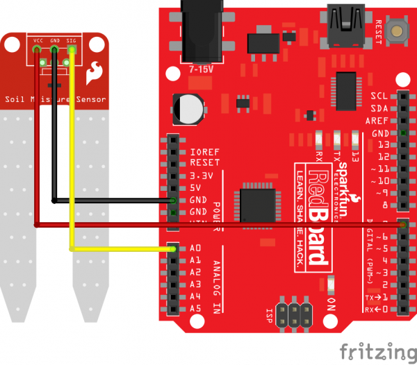
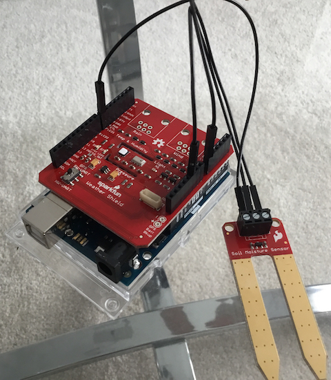
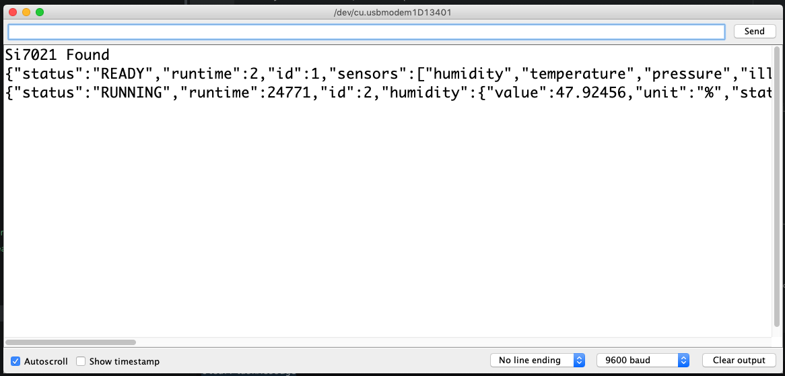

# Introduction
To begin installation, you must setup the code on your **developer machine** and follow these instructions on how to setup the device.

Start by checking out the source code:

        $ git clone https://github.com/mikaponics/mikapod-soil-arduino.git

Before we begin, these instructions assume you have basic knowledge of the **Arduino** platform. If you have no experience, please read the following links:

* [What is an Arduino?](https://learn.sparkfun.com/tutorials/what-is-an-arduino)

* [Installing Arduino IDE](https://learn.sparkfun.com/tutorials/installing-arduino-ide)

* [Installing an Arduino Library](https://learn.sparkfun.com/tutorials/installing-an-arduino-library)

* [Introduction to Arduino Uno via YoutTube](https://youtu.be/0TM_AbK3Epc)

# Configuring Hardware

To begin, please follow these instructions:

1. Attach the **Sparkfun Weather Shield** on top of the **Arduino** shield.

2. Connect the **SparkFun Soil Moisture Sensor** on top of the **Sparkfun Weather Shield** using the following [schematic](https://learn.sparkfun.com/tutorials/soil-moisture-sensor-hookup-guide):

    

3. Once completed you should see something like this (see below).

    

4. Connect the **Arduino** to your development machine using the **USB Standard A-B** cable.

5. On your machine, load up **Arduino IDE**.

6. Setup the connection according to your machine.

# Configure Software
The following instructions explain how our application in the **Arduino** device.

1. Copy and paste the [``mikapod-soil-arduino.ino``](https://github.com/mikaponics/mikapod-soil-arduino/blob/master/mikapod-soil-arduino/mikapod-soil-arduino.ino) to the **Arduino IDE**.

2. Please install the following libraries using the **Arduino Library Manager**:

    * [ArduinoJson](https://arduinojson.org)
    * [SparkFun MPL3115](https://github.com/sparkfun/MPL3115A2_Breakout)
    * [SparkFun Si7021](https://github.com/sparkfun/SparkFun_Si701_Breakout_Arduino_Library)

3. Click **Verify** and **Upload**. This will setup our **Arduino** device.

4. Let us confirm the device works. Load up the **Serial Monitor** in **Adruino IDE**. Once the conosle loads up, type in the number `1` and hit `enter`, you should see the device return a JSON result.

    

5. If you see something similar to the above then congradulations you have successfully installed **Mikapd Soil** for the Arduino.
